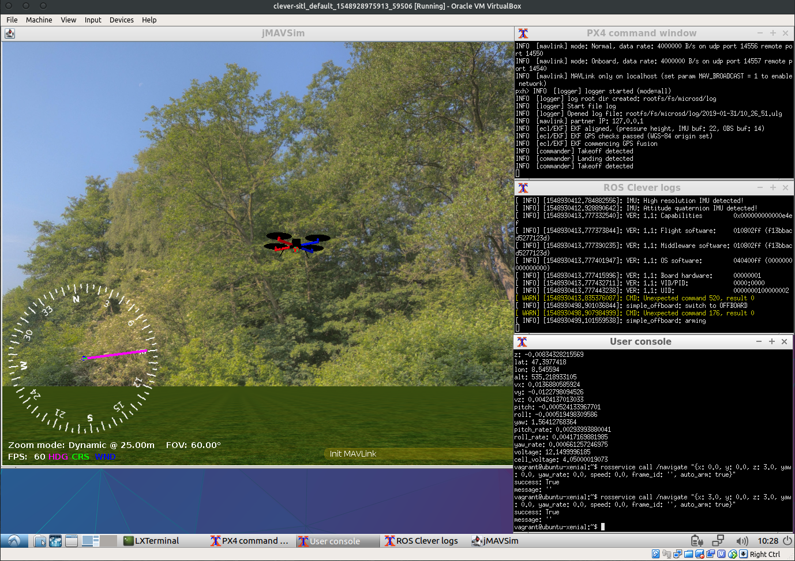

# clever-sim

Симулятор [Клевера](https://github.com/copterexpress/clever) на базе Vagrant.



## Описание

Цель создания данного репозитория - упрощение запуска симулятора SITL (software in the loop) из прошивки PX4 с подключением к ROS-пакетам Клевера. Предоставленные скрипты позволяют автоматически установить и настроить всё необходимое для запуска симулятора в виртуальной машине. Возможен выбор одной из сред симуляции ([jMAVSim](https://dev.px4.io/en/simulation/jmavsim.html) или [Gazebo](http://gazebosim.org/)); дополнительно запускается программное обеспечение полётного контроллера PX4 в режиме SITL, а также пакеты Клевера, настроенные для работы с симулятором.

Виртуальная машина основывается на **Ubuntu 16.04** как на дистрибутиве, официально совместимом с **ROS Kinetic**.

В контейнере также находятся интерпретаторы Python 2 и 3, а также компиляторы gcc и g++ версии 5.4.0 (стандарт для Ubuntu 16.04) и все необходимые для сборки PX4 и Клевера пакеты. Кроме того, установлены пакеты **ROS Desktop**, включающие в себя утилиты визуализации (например, [rqt](http://wiki.ros.org/rqt) и [rviz](http://wiki.ros.org/rviz)).

## Требования

Для успешной сборки и запуска требуется [Vagrant](https://www.vagrantup.com/) версии не ниже 2.2.3 и [VirtualBox](https://www.virtualbox.org/) версии не ниже 5.2.24.

**Внимание!** Работа с Virtualbox 6.0+ пока не поддерживается из-за проблем с графической подсистемой VirtualBox!

## Запуск

Для запуска требуется установить [Virtualbox 5.2.24](https://www.virtualbox.org/wiki/Download_Old_Builds_5_2), [Vagrant 2.2.3](https://www.vagrantup.com/downloads.html) и плагин [Vagrant-VBGuest](https://github.com/dotless-de/vagrant-vbguest) для Vagrant, поддерживающий актуальность установленных гостевых дополнений в виртуальной машине; без него графическая подсистема
будет использовать программную растеризацию.

Для установки плагина в командной строке выполните:

```
$ vagrant plugin install vagrant-vbguest
```

Склонируйте или скачайте в локальную папку содержимое репозитория. Далее, в папке с клонированным репозиторием выполните

```
$ vagrant up
```

В первый раз будет производиться установка всего необходимого программного обеспечения, поэтому выполнение этой команды может занять некоторое время. Последующие запуски будут происходить быстрее.

После выполнения этой команды появится окно VirtualBox с запущенной виртуальной машиной.

### Запуск легковесного симулятора jMAVSim

На рабочем столе виртуальной машины находится файл для запуска симулятора jMAVSim. Дважды нажмите на пиктограмму "jMAVSim SITL" для его запуска.

## Работа с симулятором

После запуска одного из симуляторов в окне виртуальной машины появятся три окна терминала:

 - Окно с названием **PX4 command window** содержит сообщения от PX4 и среды симулятора; в этом же окне доступна консоль управления PX4
 
 - Окно с названием **ROS Clever logs** содержит сообщения от сервисов Клевера
 
 - Окно с названием **User console** позволяет работать с командной оболочкой внутри контейнера (для выполнения различных команд и запуска утилит ROS)

При необходимости можно запустить дополнительные пользовательские консоли, набрав в пользовательской консоли

```
 $ xterm -e /bin/bash &
```

Кроме того, в контейнере будет запущено окно визуализации выбранного симулятора.

**Примечание:** При запуске контейнера с программной отрисовкой окно **Gazebo**, возможно, будет перекрывать окна терминалов.
В этом случае можно воспользоваться панелью задач, расположенной внизу окна виртуальной машины, для выбора нужного окна.

## Остановка симулятора

В папке с клонированным репозиторием выполните

```
$ vagrant halt
```

## Внесение изменений

В файле Vagrantfule описана конфигурация создаваемой виртуальной машины. Возможности этого файла документированы в [официальной документации Vagrant](https://www.vagrantup.com/docs/vagrantfile/).

Файлы, содержащие инструкции по установке и сборке симулятора, находятся в папке ```provision``` данного репозитория. Эти скрипты выполняются при создании виртуальной машины (при первом запуске ```vagrant up```). Их изменение следует производить на свой страх и риск.

Основные этапы, подлежащие изменению, - это установка пакетов Клевера, а также запуск программ при запуске контейнера. Всё это
настраивается в скриптах, находящихся в папке ```scripts``` данного репозитория:
 
 - ```clever_install.sh``` - скрипт для установки пакетов Клевера и их зависимостей. Запускается при сборке контейнера
 
 - ```clever_update.sh``` - скрипт для применения обновлений к пакетам Клевера. Запускается при запуске контейнера
 
 - ```start_gui.sh``` - скрипт, запускающий окна терминала, описанные выше. Настроен на запуск jMAVSim. Запускается при
 запуске контейнера с "прямой" отрисовкой
 
 - ```start_gui_gazebo.sh``` - скрипт, запускающий окна терминала. Настроен на запуск Gazebo. Запускается при запуске
 контейнера с программной отрисовкой
 
 - ```start_px4_sitl.sh``` - скрипт для запуска PX4 и симулятора jMAVSim
 
 - ```start_px4_sitl_gazebo.sh``` - скрипт для запуска PX4 и симулятора Gazebo
 
 - ```start_clever.sh``` - скрипт для запуска ROS и Клевера

Эти файлы копируются в виртуальную машину при её создании.

Для того, чтобы удалить и заново создать виртуальную машину (со всеми внесенными изменениями), следует выполнить в папке с репозиторием:

```
$ vagrant destroy default
$ vagrant up
```

